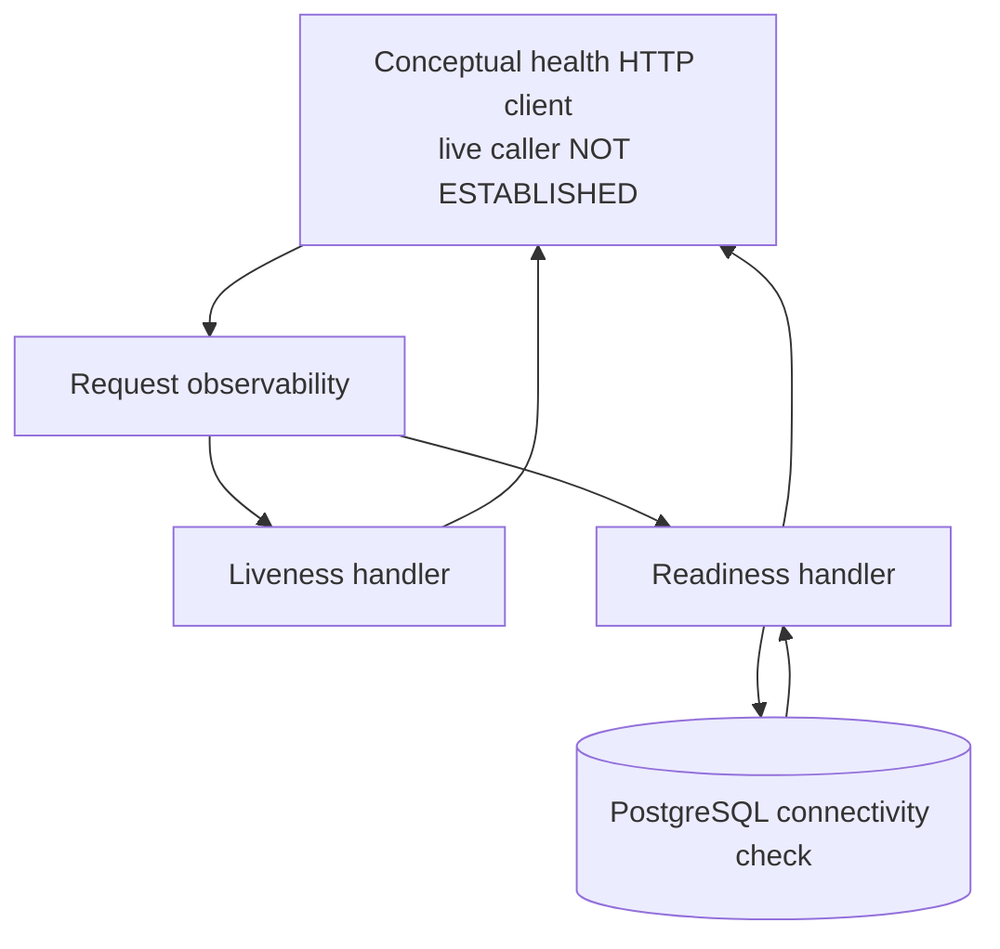
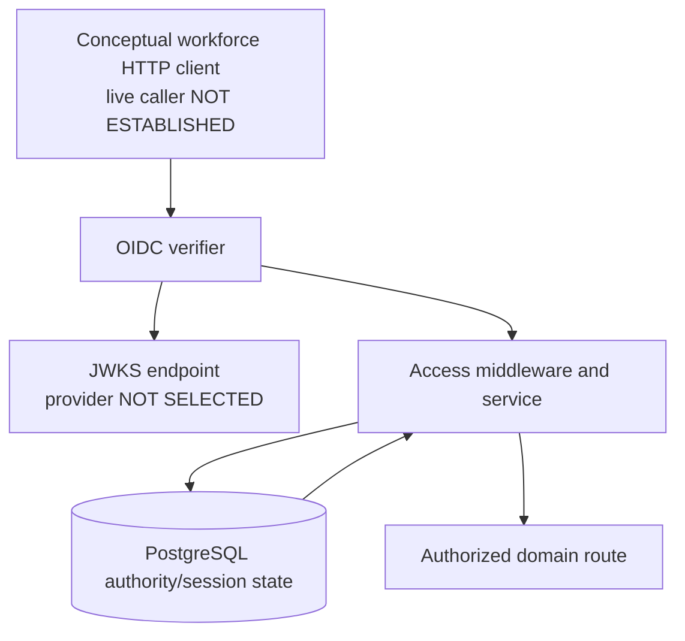
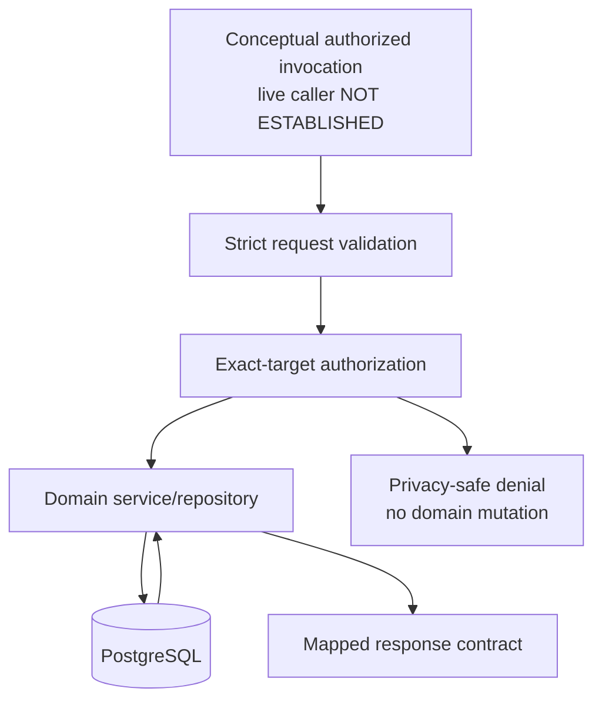
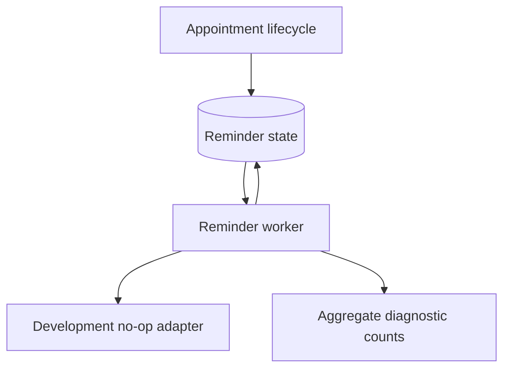
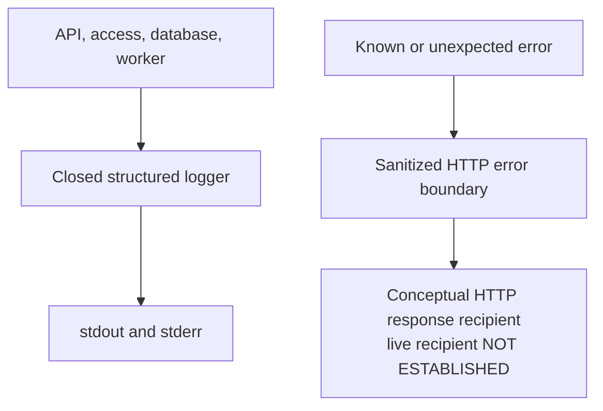
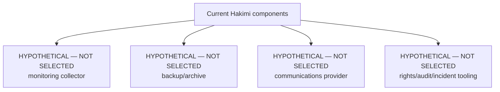

# OPEN-10 Hypothetical Data Flow And Trust-Boundary Evidence Pack

> **PROPOSED FOR QUALIFIED REVIEW**
>
> **HYPOTHETICAL**
>
> **SYNTHETIC DATA ONLY**
>
> **NOT APPROVED FOR PRODUCTION**

## 1. Document Control

| Field                                                                                          | Value                                                                                                                                    |
| ---------------------------------------------------------------------------------------------- | ---------------------------------------------------------------------------------------------------------------------------------------- |
| Purpose                                                                                        | Reconcile current repository flows and explicitly unselected future questions for qualified `OPEN-10` review                             |
| Evidence status                                                                                | Repository-derived technical evidence and hypothetical review questions; not legal advice, a legal opinion, or a regulator determination |
| Repository base commit                                                                         | `a40351b6e6e33c38e58a6a68b46abe0f673a478c`                                                                                               |
| Review date                                                                                    | 2026-08-29                                                                                                                               |
| Decision effect                                                                                | None; this document does not select `APPROVE`, `REVISE`, or `REJECT` and does not close an OPEN decision                                 |
| Production deployment                                                                          | `NOT AUTHORIZED`                                                                                                                         |
| Real patient-data processing                                                                   | `NOT AUTHORIZED`                                                                                                                         |
| Production architecture and operating entity                                                   | `NOT SELECTED`                                                                                                                           |
| Providers, regions, facilities, vendors, recipients, and operational locations                 | `NOT SELECTED`                                                                                                                           |
| Controller, processor, joint-controller, and healthcare roles                                  | `NOT DETERMINED`                                                                                                                         |
| Legal classifications and lawful bases                                                         | `NOT DETERMINED`                                                                                                                         |
| Retention, deletion, transfer, registration, DPIA, DPO, breach, audit, and rights requirements | `NOT DETERMINED`                                                                                                                         |
| Governing decisions                                                                            | `OPEN-02`, `OPEN-06`, `OPEN-07`, `OPEN-08`, `OPEN-10`, and `OPEN-12` remain `PENDING`                                                    |
| Production gates                                                                               | All remain `BLOCKED`                                                                                                                     |
| Product-owner review                                                                           | [GitHub issue #41](https://github.com/wku572/hakimi-healthcare-platform/issues/41)                                                       |
| Companion operating model                                                                      | [OPEN-10 hypothetical operating model](./OPEN10_HYPOTHETICAL_OPERATING_MODEL.md)                                                         |
| Authoritative inventory                                                                        | [OPEN-10 proposed data inventory](./OPEN10_PROPOSED_DATA_INVENTORY.md)                                                                   |
| Qualified review questionnaire                                                                 | [OPEN-10 qualified legal-review questionnaire](./OPEN10_QUALIFIED_LEGAL_REVIEW_QUESTIONNAIRE.md)                                         |

Technical readiness cannot authorize production deployment or processing of real patient data. The diagrams and review questions do not select a deployment architecture, provider, network zone, operating entity, facility, vendor, recipient, or location.

### Technical Evidence Inspected

- All six up/down migration pairs, the migration catalogue and runner, and `apps/api/src/schema-verify.ts`.
- `apps/api/openapi.yaml`, `apps/api/src/app.ts`, every Express domain router, strict request schema, service, repository, and shared API contract.
- `apps/api/src/access`, including OIDC verification, policy, middleware, exact-target authorization/session linearization, provisioning, and revocation recovery.
- Reminder creation, repository leasing/state transitions, worker processing, development no-op adapter, and aggregate diagnostics.
- Environment parsers, `.env.example`, database readiness, structured logger, request observability, API lifecycle, and centralized error middleware.
- All API and shared test files, including synthetic identity, privacy, rollback, migration, and concurrency coverage.
- Existing product, access-control, operations, Sprint 16, OPEN-10, and traceability records.

External legal context is limited to the Ethiopian Ministry of Justice [publication page for Personal Data Protection Proclamation No. 1321/2024](https://justice.gov.et/en/law/personal-data-protection-proclamation/) and the [official proclamation PDF](https://justice.gov.et/wp-content/uploads/2025/04/seasiisia-seusiNse%C2%A1-1321-2016.pdf). They are inputs for qualified review only. This document does not interpret the instrument or conclude that any provision applies to Hakimi.

### Evidence Limitation

Repository evidence defines six migration pairs, 11 PostgreSQL tables including `schema_migrations`, 10 schema-verified application/workforce tables, 119 total columns, and 115 schema-verified columns. No PostgreSQL service was started or changed for this task, and this document does not claim that any live database currently has those migrations applied.

Interpretation rule: `CURRENT` means a repository-implemented interface, mechanism, or behavior. It is not evidence of deployment, live traffic, an actual caller or workforce user, a selected identity provider, an operating entity, a production location, or real patient-data processing. Synthetic tests demonstrate invocation behavior only.

## 2. Current Technical Boundary Versus Hypothetical Production Boundary

### Repository-Implemented Technical Components And Interfaces

| Component                          | Current evidence                                                                        | Current boundary                                                                                               |
| ---------------------------------- | --------------------------------------------------------------------------------------- | -------------------------------------------------------------------------------------------------------------- |
| Public health HTTP interface       | `createApp`; `getHealthLive`; `getHealthReady`                                          | Exposes two public aggregate health operations; a live caller and live traffic are not established             |
| Workforce-protected HTTP interface | OpenAPI bearer security and 24 protected route mappings                                 | Accepts bounded bearer-protected requests when invoked; actual users, callers, and traffic are not established |
| Hakimi API                         | `server.ts`; `createApp`                                                                | Express application composition containing observability, access, validation, and domain modules               |
| OIDC verifier                      | `createOidcVerifier`                                                                    | Implements issuer/audience/algorithm/timing/MFA verification when invoked; provider `NOT SELECTED`             |
| Access-control boundary            | `createAccessAuthenticationMiddleware`; `createAccessService`; `createAccessRepository` | Server-derived actor, role, facility, target, and session checks                                               |
| Domain modules                     | Facility, practitioner, patient, and appointment routers/services/repositories          | Parameterized PostgreSQL access and mapped API contracts                                                       |
| PostgreSQL                         | Migrations `001` through `006`; `schema-verify.ts`                                      | Repository-defined table structures; no live database or applied live schema is established                    |
| Reminder worker                    | `runReminderWorker`; `processReminderCycle`                                             | Implements PostgreSQL-backed claim and transition behavior; live execution is not established                  |
| Development reminder adapter       | `createDevelopmentReminderDeliveryAdapter`                                              | In-process no-op; sends no communication                                                                       |
| Structured diagnostics             | `createStructuredLogger`; request/lifecycle/database/worker callers                     | Implements a closed privacy-safe JSON allowlist to stdout/stderr; live emission is not established             |
| Provisioning command               | `provision.ts`; `createProvisioningService`                                             | Implements interactive or restricted-file stdin; actual operator use is not established                        |
| Migration/schema tools             | Migration runner and schema verifier                                                    | Implement operator-invoked catalogue/schema behavior; live invocation is not established                       |
| Test runner                        | API/shared tests and disposable integration database conventions                        | Synthetic test data and identities only                                                                        |

#### Current PostgreSQL Table Boundary

| Repository-defined table            | Owning mechanism                         | Mapped flow(s)                 | Schema verification                               |
| ----------------------------------- | ---------------------------------------- | ------------------------------ | ------------------------------------------------- |
| `schema_migrations`                 | Migration runner                         | DF-018                         | Runner-managed; not checked by `schema-verify.ts` |
| `healthcare_facilities`             | Facility repository                      | DF-006, DF-017                 | Verified                                          |
| `practitioners`                     | Practitioner repository                  | DF-007, DF-010, DF-017         | Verified                                          |
| `practitioner_facility_assignments` | Practitioner/access repositories         | DF-005, DF-007, DF-010, DF-017 | Verified                                          |
| `patients`                          | Patient/appointment repositories         | DF-008, DF-010                 | Verified                                          |
| `patient_facility_registrations`    | Patient/appointment/access repositories  | DF-005, DF-008, DF-010         | Verified                                          |
| `appointments`                      | Appointment/reminder/access repositories | DF-005, DF-010 through DF-012  | Verified                                          |
| `appointment_reminders`             | Reminder repository/worker               | DF-011 through DF-013          | Verified                                          |
| `workforce_actors`                  | Access/provisioning repositories         | DF-003, DF-005, DF-016, DF-017 | Verified                                          |
| `workforce_role_assignments`        | Access/provisioning repositories         | DF-005, DF-016, DF-017         | Verified                                          |
| `workforce_sessions`                | Access/provisioning repositories         | DF-005, DF-016, DF-017         | Verified                                          |

All 11 repository-defined tables are represented. The ten application/workforce tables and their 115 columns are schema-verified; the migration runner owns the four-column catalogue table, for 119 repository-defined columns in total.

### Hypothetical Or Unselected Components

Every component below is **HYPOTHETICAL — NOT SELECTED** and is not implemented by this evidence pack.

| Component                     | Review purpose only                                                                        | Current fact                         |
| ----------------------------- | ------------------------------------------------------------------------------------------ | ------------------------------------ |
| Production identity provider  | Identity, MFA, JWKS, support, location, and contract questions                             | No provider selected                 |
| Production hosting/network    | Hosting, isolation, region, facility, and operations questions                             | No topology or provider selected     |
| Monitoring collector          | Collection, access, location, retention, and alerting questions                            | Runtime emits locally only           |
| Backup/archive system         | Backup, restore, archival, deletion, and legal-hold questions                              | No production backup service exists  |
| Communications provider       | Reminder channel, content, recipient, failure, and transfer questions                      | Development adapter is a no-op       |
| External audit/evidence store | Security/clinical event, integrity, access, review, and retention questions                | No approved audit store exists       |
| Support/incident tooling      | Remote access, incident, breach, evidence, and ownership questions                         | No tool, location, or owner selected |
| Rights/legal-hold workflow    | Identity verification, request handling, restriction, export, deletion, and hold questions | No production workflow exists        |

Patient authentication, patient sessions, recovery, self-service, patient applications, clinical records, payments, claims, production communications, and real patient-data processing remain outside the current boundary.

## 3. Stable Flow Register

The technical and governance facets form one logical flow register. Each `DF-###` appears exactly once in each facet, and the two sets must be identical. Later diagrams and reconciliation tables reference, but do not redefine, these IDs.

Reviewer codes: `LEGAL` qualified legal counsel; `PRIV` privacy/data protection; `CLIN` clinical safety/healthcare regulation; `SEC` information security; `REC` records management; `IDENT` patient administration/identity; `OPS` platform/operations; `PRODUCT` product decision authority.

### 3.1 Technical Facet

| ID     | Flow                                                     | Status                                                            | Interface initiator or internal trigger                                        | Source inventory IDs                                          | Data categories                                                                | Processing components                                                              | Persisted destination                                                    | Implemented recipient boundary                                                            | Authentication boundary                                                            | Authorization boundary                                                             | Trust boundaries       | Exact current evidence                                                                                       |
| ------ | -------------------------------------------------------- | ----------------------------------------------------------------- | ------------------------------------------------------------------------------ | ------------------------------------------------------------- | ------------------------------------------------------------------------------ | ---------------------------------------------------------------------------------- | ------------------------------------------------------------------------ | ----------------------------------------------------------------------------------------- | ---------------------------------------------------------------------------------- | ---------------------------------------------------------------------------------- | ---------------------- | ------------------------------------------------------------------------------------------------------------ |
| DF-001 | Public liveness interface processing                     | `CURRENT INTERFACE; LIVE TRAFFIC NOT ESTABLISHED`                 | Conceptual health HTTP client; live caller not established                     | INV-017, INV-029                                              | Aggregate health; correlation metadata                                         | Request observability; `createApp` liveness handler                                | None                                                                     | Conceptual HTTP response recipient; live recipient not established                        | None                                                                               | Public route                                                                       | TB-001, TB-010         | `apps/api/src/app.ts :: createApp`; `apps/api/src/http/request-observability.ts`                             |
| DF-002 | Public readiness interface and PostgreSQL result         | `CURRENT INTERFACE; LIVE TRAFFIC NOT ESTABLISHED`                 | Conceptual health HTTP client; live caller not established                     | INV-017, INV-023, INV-028, INV-029                            | Aggregate dependency state; connectivity event; correlation metadata           | Readiness handler; `createDatabaseReadinessCheck`; PostgreSQL                      | No domain mutation; stdout/stderr event only                             | Conceptual HTTP response recipient; live recipient not established; local diagnostic sink | None                                                                               | Public route; bounded readiness query                                              | TB-001, TB-004, TB-010 | `apps/api/src/app.ts`; `apps/api/src/database.ts`                                                            |
| DF-003 | Workforce bearer-token authentication interface          | `CURRENT MECHANISM; LIVE TRAFFIC NOT ESTABLISHED`                 | Conceptual workforce HTTP client; live caller not established                  | INV-010, INV-018, INV-021                                     | Transient token/claims; actor linkage; candidate authority                     | Access middleware; OIDC verifier; access service/repository                        | Reads workforce authority; no raw token persistence                      | Access middleware; no external recipient established                                      | OIDC bearer verification                                                           | Protected-route lookup and coarse role check                                       | TB-002, TB-003, TB-004 | `createAccessAuthenticationMiddleware`; `createOidcVerifier`; `findAuthorizationCandidate`                   |
| DF-004 | JWKS/key-resolution mechanism                            | `CURRENT MECHANISM; PROVIDER AND LIVE TRAFFIC NOT ESTABLISHED`    | OIDC verifier when invoked; live resolution not established                    | INV-018, INV-024                                              | Key metadata and configured trust                                              | `jose` remote JWK set and JWT verification                                         | Library memory/cache only; no application table                          | OIDC verifier in process; external provider not selected                                  | Configured HTTPS requirement outside loopback development/test                     | Configured URI, issuer, audience, algorithm, timing, and MFA allowlists            | TB-003                 | `apps/api/src/access/oidc-verifier.ts :: createOidcVerifier`; `apps/api/src/env.ts :: loadAccessEnvironment` |
| DF-005 | Server-derived authorization and session mechanism       | `CURRENT MECHANISM; LIVE TRAFFIC NOT ESTABLISHED`                 | Verified request context when invoked; live request not established            | INV-004, INV-007, INV-008, INV-010, INV-011, INV-012, INV-021 | Roles, facility scope, practitioner/resource relationships, session state      | Policy; access service; parameterized exact-target locking and session transaction | `workforce_sessions` insert/update; authority tables read                | Immutable in-process authorization context; no external recipient established             | Verified OIDC identity                                                             | Field, role, target, current state, inactivity, expiry, and activation-time checks | TB-002, TB-004         | `createAccessService`; `touchSession`; `toDomainAuthorizationScope`                                          |
| DF-006 | Facility interface reads and mutations                   | `CURRENT INTERFACE; LIVE TRAFFIC NOT ESTABLISHED`                 | Conceptual authorized invocation; live caller not established                  | INV-002, INV-013                                              | Facility/business request and response data                                    | Facility schema/router/service/repository                                          | `healthcare_facilities` for mutations                                    | Mapped response interface; live recipient not established                                 | DF-003                                                                             | DF-005 plus SQL scope predicates                                                   | TB-002, TB-004         | `createFacilitiesRouter`; `createHealthcareFacilityService`; `createHealthcareFacilityRepository`            |
| DF-007 | Practitioner and assignment interface behavior           | `CURRENT INTERFACE; LIVE TRAFFIC NOT ESTABLISHED`                 | Conceptual authorized invocation; live caller not established                  | INV-003, INV-004, INV-014                                     | Practitioner/workforce and roster data                                         | Practitioner schemas/router/service/repository                                     | `practitioners`; `practitioner_facility_assignments`                     | Mapped response interface; live recipient not established                                 | DF-003                                                                             | DF-005 plus facility/practitioner relationships and field allowlists               | TB-002, TB-004         | `createPractitionersRouter`; `createPractitionerService`; `createPractitionerRepository`                     |
| DF-008 | Synthetic patient-registration interface behavior        | `CURRENT INTERFACE; SYNTHETIC ONLY; LIVE TRAFFIC NOT ESTABLISHED` | Conceptual authorized invocation; live caller not established                  | INV-005, INV-006, INV-007, INV-015                            | Patient identifiers, demographics, contact, address, facility MRN/registration | Patient schemas/router/service/repository                                          | `patients`; `patient_facility_registrations`                             | Mapped response interface; live recipient not established                                 | DF-003                                                                             | DF-005 and mandatory facility-scoped SQL                                           | TB-002, TB-004         | `createPatientsRouter`; `createPatientService`; `createPatientRepository`                                    |
| DF-009 | Patient-deactivation policy-denial interface             | `CURRENT POLICY-BLOCKED; LIVE TRAFFIC NOT ESTABLISHED`            | Conceptual authenticated invocation; live caller not established               | INV-015, INV-021, INV-029                                     | Patient target identifier; authorization/error metadata                        | Access middleware/service/policy                                                   | None; patient service and repository are not called                      | Privacy-safe denial interface; live recipient not established                             | DF-003 required                                                                    | `deactivatePatient` has zero permitted roles; exact target remains denied          | TB-002, TB-004         | `operationPolicy.deactivatePatient`; patient route authorization precedes service call                       |
| DF-010 | Synthetic appointment interface behavior                 | `CURRENT INTERFACE; SYNTHETIC ONLY; LIVE TRAFFIC NOT ESTABLISHED` | Conceptual authorized invocation; live caller not established                  | INV-003, INV-004, INV-005, INV-007, INV-008, INV-016          | Schedule, status, cancellation reason, related summaries                       | Appointment schemas/router/service/repository                                      | `appointments`; related reminder transitions via DF-011                  | Mapped response interface; live recipient not established                                 | DF-003                                                                             | DF-005 plus patient/facility/practitioner relationships and SQL overlap protection | TB-002, TB-004         | `createAppointmentsRouter`; `createAppointmentService`; `createAppointmentRepository`                        |
| DF-011 | Reminder creation and appointment-driven state changes   | `CURRENT`                                                         | Appointment lifecycle                                                          | INV-008, INV-009                                              | Schedule version, reminder kind/time/state                                     | Appointment service and reminder repository in appointment transaction             | `appointment_reminders`; `appointments.schedule_version`                 | Reminder worker/database                                                                  | In-process service boundary                                                        | Appointment authorization already completed; database constraints/idempotency      | TB-004, TB-005         | `createAppointmentService`; reminder command methods                                                         |
| DF-012 | Reminder-worker claim and processing cycle               | `CURRENT`                                                         | Reminder worker                                                                | INV-008, INV-009, INV-020, INV-025                            | Reminder/appointment state, lease, attempt and aggregate outcome               | Worker; reminder repository; processing service                                    | Reminder status, lease, attempts, error category and terminal timestamps | Development adapter; aggregate local diagnostics                                          | Database connection configuration; no selected workload identity                   | Repository lease token/state predicates; no HTTP workforce grant                   | TB-005, TB-006, TB-010 | `processReminderCycle`; `processClaimedReminder`; `createReminderRepository`                                 |
| DF-013 | Development no-op delivery boundary                      | `CURRENT DEVELOPMENT NO-OP`                                       | Reminder worker                                                                | INV-009, INV-020                                              | Transient reminder processing context                                          | `createDevelopmentReminderDeliveryAdapter`                                         | Adapter stores/sends nothing; worker may mark technical delivery success | No external recipient                                                                     | In-process interface                                                               | None beyond worker state checks                                                    | TB-006                 | `apps/api/src/reminders/adapter.ts`                                                                          |
| DF-014 | Correlation and sanitized HTTP errors                    | `CURRENT MECHANISM; LIVE TRAFFIC NOT ESTABLISHED`                 | HTTP invocation or API error when exercised; live traffic not established      | INV-029                                                       | Request ID; stable code; sanitized/generic message; validation details         | Request-observability and error middleware                                         | None                                                                     | HTTP response interface; live recipient not established                                   | Inherits route boundary                                                            | Known `ApiError` contract; unknown errors sanitized                                | TB-001, TB-002         | `createRequestObservabilityMiddleware`; `createApiErrorHandler`; `toApiErrorResponse`                        |
| DF-015 | Structured operational event output                      | `CURRENT`                                                         | API, access, database, provisioning, or worker component                       | INV-026, INV-028                                              | Closed event envelope and aggregate counters                                   | `createStructuredLogger` and current event callers                                 | stdout/stderr only                                                       | Local process sink; future collector absent                                               | None                                                                               | Closed field/event allowlists and severity filtering                               | TB-010                 | `apps/api/src/observability/logger.ts`; current logger call sites                                            |
| DF-016 | Controlled workforce provisioning                        | `CURRENT MECHANISM; NON-HTTP USE NOT ESTABLISHED`                 | Conceptual controlled operator invocation; actual operator/use not established | INV-010, INV-011, INV-012, INV-019                            | Actor linkage, role/scope, activation and revocation command fields            | Strict stdin parser; provisioning transaction                                      | Workforce actor/role/session tables                                      | Access repository/database; aggregate affected-count boundary                             | Application does not define operator authentication; production control unresolved | Strict action schema, restricted input modes, SQL constraints/locks                | TB-007, TB-004, TB-010 | `provision.ts`; `provisioningCommandSchema`; `createProvisioningService`                                     |
| DF-017 | Session revocation and recovery                          | `CURRENT; NON-HTTP`                                               | Domain lifecycle or controlled operator                                        | INV-002, INV-003, INV-004, INV-010, INV-011, INV-012, INV-019 | Target lifecycle, actor/session and revocation reason                          | Access service/repository; idempotent provisioning recovery actions                | `workforce_sessions.revoked_at/revocation_reason`                        | Access boundary; aggregate affected count                                                 | Domain request or controlled provisioning boundary                                 | Target-specific locking and revocation SQL                                         | TB-004, TB-007, TB-010 | `revokeForFacility`; `revokeForPractitioner`; `revokeForAssignment`; recovery command variants               |
| DF-018 | Migration catalogue and schema management                | `CURRENT TOOLING; LIVE USE NOT ESTABLISHED`                       | Tool command when invoked; actual operator/use not established                 | INV-001, INV-022, INV-023                                     | Migration metadata, SQL schema, database configuration names                   | Migration catalogue/runner; schema verifier                                        | `schema_migrations` and application schema when explicitly run           | Tool output boundary; live recipient not established                                      | Database connection configuration; production operator identity unresolved         | Migration checksum/order/transaction logic; schema assertions                      | TB-008, TB-004         | `apps/api/src/migrations`; `migrate.ts`; `schema-verify.ts`                                                  |
| DF-019 | Environment/configuration injection                      | `CURRENT`                                                         | Process environment or optional local development file                         | INV-022, INV-023, INV-024, INV-025, INV-026                   | Runtime, database, OIDC, worker and logging configuration names                | Strict API/worker Zod parsers                                                      | Process memory only                                                      | API, worker, migration/schema processes                                                   | External secret/config identity not implemented                                    | Closed parser schemas and production HTTPS rule                                    | TB-009                 | `loadEnvironment`; `loadAccessEnvironment`; `loadReminderWorkerConfig`; `.env.example`                       |
| DF-020 | Synthetic unit and integration testing                   | `CURRENT TEST ONLY`                                               | Test runner                                                                    | INV-030, INV-031, INV-032                                     | Synthetic domain, workforce/OIDC/session, config and diagnostic fixtures       | API/shared test suites; in-memory doubles; disposable test database                | Test memory/database only                                                | Test runner/reviewer                                                                      | Synthetic test mechanisms only                                                     | Test-specific setup; no production authority                                       | TB-011                 | `apps/api/test`; `packages/shared/test`                                                                      |
| DF-021 | Future monitoring collection                             | `HYPOTHETICAL — NOT SELECTED`                                     | Future runtime/collector                                                       | INV-028, INV-033                                              | Privacy-safe operational events only                                           | Future collector not implemented                                                   | `NOT SELECTED`                                                           | `NOT SELECTED`                                                                            | `NOT DETERMINED`                                                                   | Access/review/alerting model `NOT DETERMINED`                                      | TB-012                 | Review question only; no implementation source                                                               |
| DF-022 | Future backup/archive                                    | `HYPOTHETICAL — NOT SELECTED`                                     | Future database/backup process                                                 | INV-033, INV-034, INV-042                                     | Potential production copies/archives                                           | Future backup/archive system not implemented                                       | `NOT SELECTED`                                                           | `NOT SELECTED`                                                                            | `NOT DETERMINED`                                                                   | Backup access, restore, hold and deletion controls `NOT DETERMINED`                | TB-013                 | Review question only; no implementation source                                                               |
| DF-023 | Future reminder communications                           | `HYPOTHETICAL — NOT SELECTED`                                     | Future reminder delivery boundary                                              | INV-033, INV-040                                              | Potential reminder content/destination/delivery evidence                       | Future communications provider not implemented                                     | `NOT SELECTED`                                                           | `NOT SELECTED`                                                                            | `NOT DETERMINED`                                                                   | Channel, content, consent, recipient and retry policy `NOT DETERMINED`             | TB-014                 | Review question only; current adapter is a no-op                                                             |
| DF-024 | Future rights/audit/breach/legal-hold evidence workflows | `HYPOTHETICAL — NOT SELECTED`                                     | Future qualified governance process                                            | INV-034, INV-041                                              | Potential rights, audit, incident, breach and hold evidence                    | Future workflow/store/tooling not implemented                                      | `NOT SELECTED`                                                           | `NOT SELECTED`                                                                            | `NOT DETERMINED`                                                                   | Identity, access, approval, integrity and separation of duties `NOT DETERMINED`    | TB-015                 | Review question only; no approved workflow/store exists                                                      |

### 3.2 Governance Facet

Every row has legal classification `NOT DETERMINED`, production entity and location `NOT SELECTED`, vendor/production recipient `NOT SELECTED`, transfer status `NOT DETERMINED`, and retention/deletion policy `NOT DETERMINED`. Current technical lifecycle facts do not establish an approved policy.

| ID     | Current technical purpose                                             | Hypothetical production-purpose question                                                  | Current lifecycle fact                                                                                 | Proposed governance classification(s)                           | Governing OPEN decisions                                      | Evidence required                           |
| ------ | --------------------------------------------------------------------- | ----------------------------------------------------------------------------------------- | ------------------------------------------------------------------------------------------------------ | --------------------------------------------------------------- | ------------------------------------------------------------- | ------------------------------------------- |
| DF-001 | Implement aggregate liveness and correlation response behavior        | What public disclosure and probe purpose are justified?                                   | Response is transient when the interface is invoked                                                    | `PUBLIC`, `INTERNAL`                                            | OPEN-06, OPEN-07, OPEN-10, OPEN-12                            | SEC, OPS, PRIV, LEGAL                       |
| DF-002 | Implement aggregate readiness and test database-connectivity behavior | What dependency detail and operational use are justified?                                 | Query is transient when invoked; event goes to stdout/stderr                                           | `PUBLIC`, `INTERNAL`, `RESTRICTED_SECURITY`                     | OPEN-06, OPEN-07, OPEN-10, OPEN-12                            | SEC, OPS, PRIV, LEGAL                       |
| DF-003 | Implement workforce-request authentication and authority resolution   | Which identity evidence is minimum and who may operate the identity service?              | Raw token/claims are transient when invoked; subject linkage/session hash may persist                  | `RESTRICTED_SECURITY`, `RESTRICTED_WORKFORCE`                   | OPEN-02, OPEN-06, OPEN-07, OPEN-10, OPEN-12                   | SEC, PRIV, OPS, LEGAL                       |
| DF-004 | Implement key resolution and signed-token validation                  | Which provider, keys, cache, outage, contract and location controls are approved?         | Key material is not stored in application tables; provider use is not established                      | `RESTRICTED_SECURITY`                                           | OPEN-02, OPEN-06, OPEN-07, OPEN-10, OPEN-12                   | SEC, PRIV, OPS, LEGAL                       |
| DF-005 | Implement exact-target authority and session-lifecycle enforcement    | Which session evidence and access purposes are justified?                                 | Session activity/expiry/revocation may persist when invoked; no approved retention period              | `RESTRICTED_SECURITY`, `RESTRICTED_WORKFORCE`                   | OPEN-02, OPEN-06, OPEN-07, OPEN-10, OPEN-12                   | SEC, PRIV, REC, LEGAL                       |
| DF-006 | Implement facility data interface behavior                            | Which fields/actions are minimum necessary per role and purpose?                          | Synthetic rows are preserved when test behavior is exercised; lifecycle is soft                        | `INTERNAL`                                                      | OPEN-02, OPEN-06, OPEN-07, OPEN-10, OPEN-12                   | PRIV, CLIN, REC, PRODUCT, LEGAL             |
| DF-007 | Implement practitioner-profile and facility-roster interface behavior | Which workforce/profile/roster fields are justified?                                      | Synthetic rows are preserved when test behavior is exercised; lifecycle is soft                        | `RESTRICTED_WORKFORCE`                                          | OPEN-02, OPEN-06, OPEN-07, OPEN-10, OPEN-12                   | PRIV, CLIN, REC, PRODUCT, LEGAL             |
| DF-008 | Implement synthetic patient-demographic and facility-MRN behavior     | Which fields, purposes, identity rules and facility ownership are approved?               | Synthetic patient/registration rows persist during exercised behavior; authorized hard deletion absent | `RESTRICTED_PATIENT`                                            | OPEN-02, OPEN-07, OPEN-08, OPEN-10, OPEN-12                   | PRIV, CLIN, IDENT, REC, PRODUCT, LEGAL      |
| DF-009 | Implement patient-deactivation denial before mutation                 | Can any future bounded deactivation authority exist?                                      | No mutation or session touch follows a denied target grant when invoked                                | `RESTRICTED_PATIENT`, `RESTRICTED_SECURITY`                     | OPEN-02, OPEN-06, OPEN-07, OPEN-08, OPEN-10, OPEN-12          | PRIV, CLIN, IDENT, REC, SEC, PRODUCT, LEGAL |
| DF-010 | Implement synthetic appointment-lifecycle behavior                    | Which schedule, status, reason, summary and practitioner views are necessary?             | Synthetic appointment rows are retained when behavior is exercised; cancellation is non-destructive    | `RESTRICTED_PATIENT`, `RESTRICTED_WORKFORCE`                    | OPEN-02, OPEN-06, OPEN-07, OPEN-08, OPEN-09, OPEN-10, OPEN-12 | PRIV, CLIN, REC, PRODUCT, LEGAL             |
| DF-011 | Create/cancel/supersede reminders with appointment transitions        | Which reminder timing/state evidence is necessary?                                        | Reminder rows and schedule versions persist                                                            | `RESTRICTED_PATIENT`                                            | OPEN-02, OPEN-06, OPEN-07, OPEN-10, OPEN-11, OPEN-12          | PRIV, CLIN, REC, PRODUCT, LEGAL             |
| DF-012 | Lease and process due reminder jobs                                   | Which workload, retry, error and operational evidence is necessary?                       | Lease/attempt/terminal states persist; context is transient                                            | `RESTRICTED_PATIENT`, `INTERNAL`                                | OPEN-02, OPEN-06, OPEN-07, OPEN-10, OPEN-11, OPEN-12          | PRIV, SEC, REC, OPS, LEGAL                  |
| DF-013 | Exercise the development delivery interface without communication     | What minimum data could a separately approved adapter receive?                            | No-op stores/sends nothing; current worker may mark technical success                                  | `RESTRICTED_PATIENT`                                            | OPEN-02, OPEN-06, OPEN-07, OPEN-10, OPEN-11, OPEN-12          | PRIV, SEC, CLIN, OPS, LEGAL                 |
| DF-014 | Correlate requests and return sanitized errors                        | Which correlation/error details are minimum necessary?                                    | Response ends with request; no application retention                                                   | `INTERNAL`                                                      | OPEN-02, OPEN-06, OPEN-07, OPEN-10, OPEN-12                   | PRIV, SEC, OPS, LEGAL                       |
| DF-015 | Emit privacy-safe operational diagnostics                             | Which events, recipients, access and retention support operations without becoming audit? | stdout/stderr only; no application retention                                                           | `RESTRICTED_AUDIT`                                              | OPEN-06, OPEN-07, OPEN-10, OPEN-12                            | PRIV, SEC, REC, OPS, CLIN, LEGAL            |
| DF-016 | Provision workforce authority through a controlled non-HTTP command   | Which operator approvals, evidence and production controls are required?                  | Authority/session changes persist atomically                                                           | `RESTRICTED_SECURITY`, `RESTRICTED_WORKFORCE`                   | OPEN-06, OPEN-07, OPEN-10, OPEN-12                            | SEC, REC, OPS, PRODUCT, LEGAL               |
| DF-017 | Revoke affected sessions and recover failed post-commit revocation    | Which revocation evidence, review and recovery ownership are required?                    | Revocation is idempotent; rows preserved                                                               | `RESTRICTED_SECURITY`, `RESTRICTED_AUDIT`                       | OPEN-06, OPEN-07, OPEN-10, OPEN-12                            | SEC, REC, OPS, PRODUCT, LEGAL               |
| DF-018 | Apply/rollback catalogue migrations and verify schema                 | Which production change authority and evidence are required?                              | Catalogue/schema change only when command explicitly runs                                              | `INTERNAL`, `RESTRICTED_SECURITY`                               | OPEN-06, OPEN-07, OPEN-10, OPEN-12                            | SEC, REC, OPS, LEGAL                        |
| DF-019 | Inject and validate named runtime configuration                       | Which secret/config providers, rotations, owners and locations are approved?              | Process lifecycle; values excluded from this document                                                  | `INTERNAL`, `RESTRICTED_SECURITY`                               | OPEN-06, OPEN-07, OPEN-10, OPEN-12                            | SEC, OPS, REC, LEGAL                        |
| DF-020 | Verify behavior with synthetic fixtures                               | What test-data controls, cleanup and evidence retention are approved?                     | Disposable/in-memory/test database lifecycle only                                                      | `RESTRICTED_PATIENT`, `RESTRICTED_SECURITY`, `INTERNAL`         | OPEN-02, OPEN-06, OPEN-07, OPEN-10, OPEN-12                   | PRIV, SEC, REC, OPS, LEGAL                  |
| DF-021 | None currently                                                        | Could operational events be collected externally under approved controls?                 | Not implemented                                                                                        | `RESTRICTED_AUDIT`                                              | OPEN-06, OPEN-07, OPEN-10, OPEN-12                            | PRIV, SEC, REC, OPS, LEGAL                  |
| DF-022 | None currently                                                        | Could approved backup/archive purposes, restore, hold and deletion be defined?            | Not implemented                                                                                        | `RESTRICTED_PATIENT`, `RESTRICTED_SECURITY`                     | OPEN-02, OPEN-06, OPEN-07, OPEN-10, OPEN-12                   | PRIV, SEC, REC, OPS, CLIN, LEGAL            |
| DF-023 | None currently                                                        | Could approved reminder channels/content/recipients/failures be defined?                  | Not implemented                                                                                        | `RESTRICTED_PATIENT`                                            | OPEN-02, OPEN-06, OPEN-07, OPEN-10, OPEN-11, OPEN-12          | PRIV, SEC, CLIN, REC, OPS, LEGAL            |
| DF-024 | None currently                                                        | Could approved rights, audit, incident, breach and legal-hold workflows be defined?       | Not implemented                                                                                        | `RESTRICTED_PATIENT`, `RESTRICTED_AUDIT`, `RESTRICTED_SECURITY` | OPEN-02, OPEN-06, OPEN-07, OPEN-08, OPEN-10, OPEN-12          | ALL REVIEWER FUNCTIONS                      |

## 4. Stable Trust-Boundary Register

These records describe only verified component interfaces or clearly hypothetical review boundaries. A conceptual client endpoint identifies where an implemented interface begins; it does not establish an actual caller, user, deployment, or traffic. The records do not infer subnets, gateways, zones, firewalls, or physical topology.

| ID     | Boundary endpoints                                                       | Status                                                         | Inventory IDs crossing                      | Verified mechanism                                                    | Identity/authentication evidence                                                | Authorization enforcement                                                      | Data classes                                                                    | Current storage/retention fact                                                                | Production location | Vendor/contract role            | Transfer/onward/remote-support status               | Security/privacy questions                                        | Required reviewers               |
| ------ | ------------------------------------------------------------------------ | -------------------------------------------------------------- | ------------------------------------------- | --------------------------------------------------------------------- | ------------------------------------------------------------------------------- | ------------------------------------------------------------------------------ | ------------------------------------------------------------------------------- | --------------------------------------------------------------------------------------------- | ------------------- | ------------------------------- | --------------------------------------------------- | ----------------------------------------------------------------- | -------------------------------- |
| TB-001 | Conceptual health HTTP client to Hakimi public health interface          | `CURRENT INTERFACE; LIVE CALLER AND TRAFFIC NOT ESTABLISHED`   | INV-017, INV-029                            | Implemented HTTP Express request/response behavior                    | None                                                                            | Public health routes only                                                      | `PUBLIC`, `INTERNAL`                                                            | Response is transient when synthetically invoked                                              | `NOT SELECTED`      | `NOT DETERMINED`                | `NOT DETERMINED`                                    | Probe disclosure, abuse, availability, correlation                | SEC, PRIV, OPS, LEGAL            |
| TB-002 | Conceptual workforce HTTP client to Hakimi workforce-protected interface | `CURRENT INTERFACE; LIVE CALLER AND TRAFFIC NOT ESTABLISHED`   | INV-013 through INV-019, INV-021, INV-029   | Implemented HTTP bearer-request and strict-schema behavior            | Verified OIDC token required by the interface                                   | Default deny, operation/field/target/role checks                               | `RESTRICTED_WORKFORCE`, `RESTRICTED_PATIENT`, `RESTRICTED_SECURITY`, `INTERNAL` | Requests are transient when synthetically invoked; authorized synthetic mutations may persist | `NOT SELECTED`      | `NOT DETERMINED`                | `NOT DETERMINED`                                    | Token theft, replay, IDOR, enumeration, minimum fields            | SEC, PRIV, CLIN, IDENT, LEGAL    |
| TB-003 | Hakimi OIDC verifier to a configured JWKS interface                      | `CURRENT MECHANISM; PROVIDER AND LIVE TRAFFIC NOT ESTABLISHED` | INV-018, INV-024                            | HTTPS required in production configuration; `jose` JWKS/JWT mechanism | Configured issuer/audience/key/algorithm/timing/MFA checks                      | Trust configuration allowlists only                                            | `RESTRICTED_SECURITY`                                                           | Library cache/memory when invoked; no application table                                       | `NOT SELECTED`      | `NOT DETERMINED`                | `NOT DETERMINED`                                    | Provider assurance, key rotation, outage, caching, transfer       | SEC, PRIV, OPS, LEGAL            |
| TB-004 | API/access/domain/tooling to PostgreSQL                                  | `CURRENT MECHANISM; LIVE DATABASE USE NOT ESTABLISHED`         | INV-001 through INV-012, INV-021, INV-023   | Parameterized PostgreSQL queries and transactions                     | Database connection material; production workload identity `NOT SELECTED`       | SQL predicates, constraints, locks, grants outside repository `NOT DETERMINED` | All implemented stored classes                                                  | Migration-defined row/lifecycle behavior; no live rows or approved retention established      | `NOT SELECTED`      | `NOT DETERMINED`                | `NOT DETERMINED`                                    | Credential custody, encryption, isolation, DBA/support access     | SEC, PRIV, REC, OPS, LEGAL       |
| TB-005 | Reminder worker to PostgreSQL                                            | `CURRENT`                                                      | INV-008, INV-009, INV-020, INV-023, INV-025 | Parameterized queries, leases, transactions                           | Database connection material; workload identity `NOT SELECTED`                  | Lease token and state predicates                                               | `RESTRICTED_PATIENT`, `INTERNAL`, `RESTRICTED_SECURITY`                         | Reminder state persists; context transient                                                    | `NOT SELECTED`      | `NOT DETERMINED`                | `NOT DETERMINED`                                    | Least privilege, concurrency, worker compromise, location         | SEC, PRIV, REC, OPS, LEGAL       |
| TB-006 | Reminder worker to development adapter                                   | `CURRENT INTERNAL NO-OP`                                       | INV-009, INV-020                            | In-process TypeScript interface                                       | Same process                                                                    | Worker state validation                                                        | `RESTRICTED_PATIENT`                                                            | Adapter stores/sends nothing                                                                  | `NOT SELECTED`      | No current external vendor      | No current transfer; future status `NOT DETERMINED` | Prevent accidental production use; future minimization            | SEC, PRIV, CLIN, OPS, LEGAL      |
| TB-007 | Conceptual controlled-operator stdin to provisioning process             | `CURRENT INTERFACE; ACTUAL OPERATOR AND USE NOT ESTABLISHED`   | INV-010, INV-011, INV-012, INV-019          | Interactive or restricted-file stdin; strict JSON schema              | Application-level operator authentication absent; production control unresolved | Closed action allowlist and transactional SQL                                  | `RESTRICTED_SECURITY`, `RESTRICTED_WORKFORCE`                                   | Input transient when invoked; synthetic authority changes may persist                         | `NOT SELECTED`      | `NOT DETERMINED`                | `NOT DETERMINED`                                    | Operator identity, approvals, endpoint security, evidence         | SEC, REC, OPS, PRODUCT, LEGAL    |
| TB-008 | Operator migration/schema tooling to PostgreSQL                          | `CURRENT TOOLING`                                              | INV-001, INV-022, INV-023                   | npm commands, SQL migration runner, schema queries                    | Database connection material                                                    | Catalogue checksum/order and explicit command boundary                         | `INTERNAL`, `RESTRICTED_SECURITY`                                               | Catalogue/schema persists when commands run                                                   | `NOT SELECTED`      | `NOT DETERMINED`                | `NOT DETERMINED`                                    | Change approval, rollback, segregation, evidence                  | SEC, REC, OPS, LEGAL             |
| TB-009 | Environment/local development file to API/worker/tools                   | `CURRENT`                                                      | INV-022 through INV-026                     | Process environment and strict parsers                                | External secret/config identity absent                                          | Closed Zod schemas                                                             | `INTERNAL`, `RESTRICTED_SECURITY`                                               | Process memory; `.env.example` placeholders only                                              | `NOT SELECTED`      | `NOT DETERMINED`                | `NOT DETERMINED`                                    | Secret issuance, rotation, access, injection, leakage             | SEC, OPS, LEGAL                  |
| TB-010 | API/worker/provisioning process to stdout/stderr                         | `CURRENT`                                                      | INV-028, INV-029                            | Structured JSON logger; closed allowlists                             | None                                                                            | Safe event/field validation and severity suppression                           | `RESTRICTED_AUDIT`, `INTERNAL`                                                  | Local stream only; no application retention                                                   | `NOT SELECTED`      | Future recipient `NOT SELECTED` | `NOT DETERMINED`                                    | Collection, access, tamper evidence, retention, audit distinction | SEC, PRIV, REC, OPS, LEGAL       |
| TB-011 | Test runner to test API/in-memory components/disposable database         | `CURRENT TEST ONLY`                                            | INV-030 through INV-032                     | Test framework, synthetic tokens/keys/data, PostgreSQL integration    | Synthetic only                                                                  | Test setup only                                                                | Proposed classes represented synthetically                                      | Disposable/test lifecycle                                                                     | `NOT SELECTED`      | `NOT DETERMINED`                | `NOT DETERMINED`                                    | Test isolation, fixture provenance, cleanup, CI access            | SEC, PRIV, REC, OPS, LEGAL       |
| TB-012 | Runtime stdout/stderr to future monitoring collector                     | `HYPOTHETICAL — NOT SELECTED`                                  | INV-028, INV-033                            | Not implemented                                                       | `NOT DETERMINED`                                                                | `NOT DETERMINED`                                                               | `RESTRICTED_AUDIT`                                                              | `NOT DETERMINED`                                                                              | `NOT SELECTED`      | `NOT DETERMINED`                | Transfer/onward/remote support `NOT DETERMINED`     | Fields, access, location, alerting, retention, contracts          | SEC, PRIV, REC, OPS, LEGAL       |
| TB-013 | PostgreSQL to future backup/archive system                               | `HYPOTHETICAL — NOT SELECTED`                                  | INV-033, INV-034, INV-042                   | Not implemented                                                       | `NOT DETERMINED`                                                                | `NOT DETERMINED`                                                               | `RESTRICTED_PATIENT`, `RESTRICTED_SECURITY`                                     | `NOT DETERMINED`                                                                              | `NOT SELECTED`      | `NOT DETERMINED`                | Transfer/onward/remote support `NOT DETERMINED`     | Scope, encryption, restore, expiry, hold, deletion evidence       | SEC, PRIV, REC, OPS, CLIN, LEGAL |
| TB-014 | Future reminder adapter to communications provider/recipient             | `HYPOTHETICAL — NOT SELECTED`                                  | INV-033, INV-040                            | Not implemented                                                       | `NOT DETERMINED`                                                                | `NOT DETERMINED`                                                               | `RESTRICTED_PATIENT`                                                            | `NOT DETERMINED`                                                                              | `NOT SELECTED`      | `NOT DETERMINED`                | Transfer/onward/remote support `NOT DETERMINED`     | Channel, consent, destination, content, failure, receipts         | SEC, PRIV, CLIN, REC, OPS, LEGAL |
| TB-015 | Hakimi data/processes to future rights/audit/incident/legal-hold tooling | `HYPOTHETICAL — NOT SELECTED`                                  | INV-034, INV-041                            | Not implemented                                                       | `NOT DETERMINED`                                                                | `NOT DETERMINED`                                                               | `RESTRICTED_PATIENT`, `RESTRICTED_AUDIT`, `RESTRICTED_SECURITY`                 | `NOT DETERMINED`                                                                              | `NOT SELECTED`      | `NOT DETERMINED`                | Transfer/onward/remote support `NOT DETERMINED`     | Identity proof, purpose, integrity, access, breach/hold authority | ALL REVIEWER FUNCTIONS           |

## 5. Conceptual Flow Diagrams

Diagrams summarize the authoritative registers above. Client and response-recipient nodes are conceptual interface actors, not evidence of deployed systems, live users, or live traffic. The diagrams do not select a deployment topology.

### Implemented Public Health Interface Behavior

| Diagram evidence | Flow records   | Trust-boundary records | Status                                                              |
| ---------------- | -------------- | ---------------------- | ------------------------------------------------------------------- |
| Public health    | DF-001, DF-002 | TB-001, TB-004, TB-010 | Current interface behavior; live caller and traffic not established |

### Implemented Workforce Authentication And Authorization Behavior

| Diagram evidence                       | Flow records          | Trust-boundary records | Status                                                                        |
| -------------------------------------- | --------------------- | ---------------------- | ----------------------------------------------------------------------------- |
| Workforce authentication/authorization | DF-003 through DF-005 | TB-002 through TB-004  | Current mechanism; live caller/traffic not established; provider not selected |

### Implemented Domain-Data Interface Behavior

| Diagram evidence | Flow records          | Trust-boundary records | Status                                                                                          |
| ---------------- | --------------------- | ---------------------- | ----------------------------------------------------------------------------------------------- |
| Domain data      | DF-006 through DF-010 | TB-002, TB-004         | Current interface behavior; synthetic only; live traffic not established; DF-009 policy-blocked |

Domain and health response bodies remain under INV-013 through INV-017; INV-029 is only correlation and sanitized error metadata.

### Implemented Reminder-Processing Behavior

| Diagram evidence    | Flow records          | Trust-boundary records | Status                                                                               |
| ------------------- | --------------------- | ---------------------- | ------------------------------------------------------------------------------------ |
| Reminder processing | DF-011 through DF-013 | TB-005, TB-006, TB-010 | Current development mechanism; live execution not established; no communication sent |

### Implemented Operational-Diagnostics Behavior

| Diagram evidence   | Flow records   | Trust-boundary records | Status                                                                                                 |
| ------------------ | -------------- | ---------------------- | ------------------------------------------------------------------------------------------------------ |
| Diagnostics/errors | DF-014, DF-015 | TB-001, TB-002, TB-010 | Current mechanism; live HTTP traffic not established; not approved security or clinical audit evidence |

### Hypothetical Future External-Service Boundaries

| Diagram evidence                  | Flow records          | Trust-boundary records | Status                                    |
| --------------------------------- | --------------------- | ---------------------- | ----------------------------------------- |
| Future external-service questions | DF-021 through DF-024 | TB-012 through TB-015  | Hypothetical; all components not selected |

These arrows expose review questions only and do not assert that a current transfer or external recipient exists.

## 6. Inventory-To-Flow Reconciliation

`NONE - NON-FLOW` means the inventory asset is an unconsumed placeholder or an absent/prohibited category and is intentionally not represented as active processing. Hypothetical mappings do not assert collection or transfer.

| Inventory ID | Mapped flow ID(s)                      | Mapped trust-boundary ID(s)            | Inventory status    | Justification                                                                                 | Missing mapping |
| ------------ | -------------------------------------- | -------------------------------------- | ------------------- | --------------------------------------------------------------------------------------------- | --------------- |
| INV-001      | DF-018                                 | TB-008, TB-004                         | `STORED`            | Migration catalogue metadata is created/read by migration tooling                             | `NO`            |
| INV-002      | DF-006, DF-017                         | TB-004                                 | `STORED`            | Facility data and lifecycle-driven revocation                                                 | `NO`            |
| INV-003      | DF-007, DF-010, DF-017                 | TB-004                                 | `STORED`            | Practitioner profiles, appointment relationship and lifecycle revocation                      | `NO`            |
| INV-004      | DF-005, DF-007, DF-010, DF-017         | TB-004                                 | `STORED`            | Assignment scope, roster operations, scheduling relationship and revocation                   | `NO`            |
| INV-005      | DF-008, DF-010                         | TB-004                                 | `STORED`            | Patient demographic/identity storage and appointment relationship                             | `NO`            |
| INV-006      | DF-008                                 | TB-004                                 | `STORED`            | Patient contact/address storage                                                               | `NO`            |
| INV-007      | DF-005, DF-008, DF-010                 | TB-004                                 | `STORED`            | Facility MRN/registration and authorization/scheduling relationship                           | `NO`            |
| INV-008      | DF-005, DF-010, DF-011, DF-012         | TB-004, TB-005                         | `STORED`            | Appointment target, lifecycle and reminder processing                                         | `NO`            |
| INV-009      | DF-011, DF-012, DF-013                 | TB-004, TB-005, TB-006                 | `STORED`            | Reminder creation, lease, processing and no-op adapter context                                | `NO`            |
| INV-010      | DF-003, DF-005, DF-016, DF-017         | TB-002, TB-004, TB-007                 | `STORED`            | Workforce actor resolution, authorization, provisioning and revocation                        | `NO`            |
| INV-011      | DF-005, DF-016, DF-017                 | TB-004, TB-007                         | `STORED`            | Role/facility authority and provisioning/revocation                                           | `NO`            |
| INV-012      | DF-005, DF-016, DF-017                 | TB-004, TB-007                         | `STORED`            | Session activity, expiration and revocation                                                   | `NO`            |
| INV-013      | DF-006                                 | TB-002                                 | `TRANSIENT`         | Facility request/response contracts                                                           | `NO`            |
| INV-014      | DF-007                                 | TB-002                                 | `TRANSIENT`         | Practitioner/assignment request/response contracts                                            | `NO`            |
| INV-015      | DF-008, DF-009                         | TB-002                                 | `TRANSIENT`         | Patient/registration request/response contracts and blocked target                            | `NO`            |
| INV-016      | DF-010                                 | TB-002                                 | `TRANSIENT`         | Appointment request/response contracts                                                        | `NO`            |
| INV-017      | DF-001, DF-002                         | TB-001                                 | `TRANSIENT`         | Health request/response payloads                                                              | `NO`            |
| INV-018      | DF-003, DF-004                         | TB-002, TB-003                         | `TRANSIENT`         | Bearer token and verified OIDC claims                                                         | `NO`            |
| INV-019      | DF-016, DF-017                         | TB-007                                 | `TRANSIENT`         | Strict provisioning and revocation-recovery input                                             | `NO`            |
| INV-020      | DF-012, DF-013                         | TB-005, TB-006                         | `TRANSIENT`         | Reminder processing context                                                                   | `NO`            |
| INV-021      | DF-003, DF-005, DF-009                 | TB-002, TB-004                         | `DERIVED`           | Server-derived authorization candidate/context and blocked policy evaluation                  | `NO`            |
| INV-022      | DF-018, DF-019                         | TB-008, TB-009                         | `CONFIGURATION`     | Non-secret API/tool configuration                                                             | `NO`            |
| INV-023      | DF-002, DF-012, DF-016, DF-018, DF-019 | TB-004, TB-005, TB-007, TB-008, TB-009 | `CONFIGURATION`     | Database connection/credential category used by runtime and tools                             | `NO`            |
| INV-024      | DF-004, DF-019                         | TB-003, TB-009                         | `CONFIGURATION`     | OIDC trust configuration                                                                      | `NO`            |
| INV-025      | DF-012, DF-019                         | TB-005, TB-009                         | `CONFIGURATION`     | Reminder-worker configuration                                                                 | `NO`            |
| INV-026      | DF-015, DF-019                         | TB-009, TB-010                         | `CONFIGURATION`     | Logging severity configuration                                                                | `NO`            |
| INV-027      | `NONE - NON-FLOW`                      | `NONE - NON-FLOW`                      | `CONFIGURATION`     | `WEB_API_BASE_URL` is an example placeholder with no current consumer                         | `NO`            |
| INV-028      | DF-002, DF-012, DF-015, DF-021         | TB-010, TB-012                         | `EMITTED`           | Current structured events and hypothetical collection question                                | `NO`            |
| INV-029      | DF-001, DF-002, DF-009, DF-014         | TB-001, TB-002                         | `EMITTED`           | Correlation and sanitized error-envelope metadata only; no domain payloads                    | `NO`            |
| INV-030      | DF-020                                 | TB-011                                 | `TEST ONLY`         | Synthetic domain fixtures                                                                     | `NO`            |
| INV-031      | DF-020                                 | TB-011                                 | `TEST ONLY`         | Synthetic workforce/OIDC/session/cryptographic fixtures                                       | `NO`            |
| INV-032      | DF-020                                 | TB-011                                 | `TEST ONLY`         | Synthetic configuration/diagnostic fixtures                                                   | `NO`            |
| INV-033      | DF-021, DF-022, DF-023, DF-024         | TB-012, TB-013, TB-014, TB-015         | `HYPOTHETICAL`      | Future vendor/location/recipient questions map only to hypothetical flows                     | `NO`            |
| INV-034      | DF-022, DF-024                         | TB-013, TB-015                         | `HYPOTHETICAL`      | Future legal/purpose/audit/retention/rights metadata maps only to hypothetical flows          | `NO`            |
| INV-035      | `NONE - NON-FLOW`                      | `NONE - NON-FLOW`                      | `ABSENT/PROHIBITED` | Real patient data has no authorized origin or flow                                            | `NO`            |
| INV-036      | `NONE - NON-FLOW`                      | `NONE - NON-FLOW`                      | `ABSENT/PROHIBITED` | Patient credentials/sessions/recovery/self-service are absent                                 | `NO`            |
| INV-037      | `NONE - NON-FLOW`                      | `NONE - NON-FLOW`                      | `ABSENT/PROHIBITED` | Production secrets/credentials/keys/real IdP accounts are prohibited from repository evidence | `NO`            |
| INV-038      | `NONE - NON-FLOW`                      | `NONE - NON-FLOW`                      | `ABSENT/PROHIBITED` | Clinical notes/diagnoses/attachments/images are absent                                        | `NO`            |
| INV-039      | `NONE - NON-FLOW`                      | `NONE - NON-FLOW`                      | `ABSENT/PROHIBITED` | Payments/insurance/claims are absent                                                          | `NO`            |
| INV-040      | DF-023                                 | TB-014                                 | `ABSENT/PROHIBITED` | Production communications records appear only as a hypothetical future question               | `NO`            |
| INV-041      | DF-024                                 | TB-015                                 | `ABSENT/PROHIBITED` | Approved security/clinical audit records appear only as a hypothetical future question        | `NO`            |
| INV-042      | DF-022                                 | TB-013                                 | `ABSENT/PROHIBITED` | Production backup/export data appears only as a hypothetical future question                  | `NO`            |

Reconciliation: 42 expected inventory IDs, 42 represented, zero missing, zero extra. Test-only IDs map only to DF-020; hypothetical IDs map only to DF-021 through DF-024; absent/prohibited IDs are either non-flows or hypothetical questions, never active current flows. Configuration is not represented as domain data. INV-028 diagnostics and INV-029 correlation/error metadata remain separate.

## 7. Operation-To-Flow Reconciliation

| Method | Exact path                                                         | OpenAPI operation ID               | Access classification                      | Flow ID(s)                     | Result                                                      |
| ------ | ------------------------------------------------------------------ | ---------------------------------- | ------------------------------------------ | ------------------------------ | ----------------------------------------------------------- |
| GET    | `/health/live`                                                     | `getHealthLive`                    | Public                                     | DF-001, DF-014                 | `MAPPED`                                                    |
| GET    | `/health/ready`                                                    | `getHealthReady`                   | Public                                     | DF-002, DF-014                 | `MAPPED`                                                    |
| POST   | `/api/v1/facilities`                                               | `createHealthcareFacility`         | Workforce-protected                        | DF-003, DF-005, DF-006         | `MAPPED`                                                    |
| GET    | `/api/v1/facilities`                                               | `listHealthcareFacilities`         | Workforce-protected                        | DF-003, DF-005, DF-006         | `MAPPED`                                                    |
| GET    | `/api/v1/facilities/{id}`                                          | `getHealthcareFacilityById`        | Workforce-protected                        | DF-003, DF-005, DF-006         | `MAPPED`                                                    |
| PATCH  | `/api/v1/facilities/{id}`                                          | `updateHealthcareFacility`         | Workforce-protected                        | DF-003, DF-005, DF-006, DF-017 | `MAPPED`                                                    |
| DELETE | `/api/v1/facilities/{id}`                                          | `deactivateHealthcareFacility`     | Workforce-protected                        | DF-003, DF-005, DF-006, DF-017 | `MAPPED`                                                    |
| POST   | `/api/v1/practitioners`                                            | `createPractitioner`               | Workforce-protected                        | DF-003, DF-005, DF-007         | `MAPPED`                                                    |
| GET    | `/api/v1/practitioners`                                            | `listPractitioners`                | Workforce-protected                        | DF-003, DF-005, DF-007         | `MAPPED`                                                    |
| GET    | `/api/v1/practitioners/{practitionerId}`                           | `getPractitionerById`              | Workforce-protected                        | DF-003, DF-005, DF-007         | `MAPPED`                                                    |
| PATCH  | `/api/v1/practitioners/{practitionerId}`                           | `updatePractitioner`               | Workforce-protected                        | DF-003, DF-005, DF-007, DF-017 | `MAPPED`                                                    |
| DELETE | `/api/v1/practitioners/{practitionerId}`                           | `deactivatePractitioner`           | Workforce-protected                        | DF-003, DF-005, DF-007, DF-017 | `MAPPED`                                                    |
| POST   | `/api/v1/practitioners/{practitionerId}/facilities`                | `createPractitionerAssignment`     | Workforce-protected                        | DF-003, DF-005, DF-007, DF-017 | `MAPPED`                                                    |
| GET    | `/api/v1/practitioners/{practitionerId}/facilities`                | `listPractitionerAssignments`      | Workforce-protected                        | DF-003, DF-005, DF-007         | `MAPPED`                                                    |
| PATCH  | `/api/v1/practitioners/{practitionerId}/facilities/{assignmentId}` | `updatePractitionerAssignment`     | Workforce-protected                        | DF-003, DF-005, DF-007, DF-017 | `MAPPED`                                                    |
| DELETE | `/api/v1/practitioners/{practitionerId}/facilities/{assignmentId}` | `deactivatePractitionerAssignment` | Workforce-protected                        | DF-003, DF-005, DF-007, DF-017 | `MAPPED`                                                    |
| POST   | `/api/v1/patients`                                                 | `createPatient`                    | Workforce-protected                        | DF-003, DF-005, DF-008         | `MAPPED`                                                    |
| GET    | `/api/v1/patients`                                                 | `listPatients`                     | Workforce-protected                        | DF-003, DF-005, DF-008         | `MAPPED`                                                    |
| GET    | `/api/v1/patients/{patientId}`                                     | `getPatientById`                   | Workforce-protected                        | DF-003, DF-005, DF-008         | `MAPPED`                                                    |
| PATCH  | `/api/v1/patients/{patientId}`                                     | `updatePatient`                    | Workforce-protected                        | DF-003, DF-005, DF-008         | `MAPPED`                                                    |
| DELETE | `/api/v1/patients/{patientId}`                                     | `deactivatePatient`                | **Workforce-protected and policy-blocked** | DF-003, DF-009, DF-014         | `MAPPED - AUTHENTICATED THEN DENIED BEFORE DOMAIN MUTATION` |
| POST   | `/api/v1/appointments`                                             | `createAppointment`                | Workforce-protected                        | DF-003, DF-005, DF-010         | `MAPPED`                                                    |
| GET    | `/api/v1/appointments`                                             | `listAppointments`                 | Workforce-protected                        | DF-003, DF-005, DF-010         | `MAPPED`                                                    |
| GET    | `/api/v1/appointments/{appointmentId}`                             | `getAppointmentById`               | Workforce-protected                        | DF-003, DF-005, DF-010         | `MAPPED`                                                    |
| PATCH  | `/api/v1/appointments/{appointmentId}`                             | `updateAppointment`                | Workforce-protected                        | DF-003, DF-005, DF-010, DF-011 | `MAPPED`                                                    |
| POST   | `/api/v1/appointments/{appointmentId}/cancel`                      | `cancelAppointment`                | Workforce-protected                        | DF-003, DF-005, DF-010, DF-011 | `MAPPED`                                                    |

Reconciliation: 26 documented HTTP operations, 26 mapped exactly once, two publicly accessible health operations, 24 workforce-protected domain operations, one policy-blocked operation within the 24, 23 protected operations with at least one workforce grant, and zero `PATIENT` role grants. OpenAPI, Express route/policy, and this table contain the same method/path/operation triples.

## 8. Repository-Defined Data-State Transitions

These are repository-implemented and synthetically tested lifecycle behaviors, not evidence of live rows, live processing, or approved audit or retention policy.

| State group             | Repository-defined transitions                                                                                                                  | Triggering flow        | Exact repository evidence                                             | Inventory IDs    | Row-preservation behavior | Session revocation behavior                                                                                      | Unresolved audit/retention question                              | OPEN decisions                                       |
| ----------------------- | ----------------------------------------------------------------------------------------------------------------------------------------------- | ---------------------- | --------------------------------------------------------------------- | ---------------- | ------------------------- | ---------------------------------------------------------------------------------------------------------------- | ---------------------------------------------------------------- | ---------------------------------------------------- |
| Facility                | Create with active default; PATCH may change `isActive`; DELETE sets inactive idempotently                                                      | DF-006, DF-017         | Facility schemas/router/service/repository                            | INV-002          | Yes                       | Lifecycle PATCH/DELETE invokes facility session revocation; recovery action exists                               | What lifecycle evidence and retention are required?              | OPEN-06, OPEN-07, OPEN-10, OPEN-12                   |
| Practitioner            | Create; authorized PATCH may change `isActive`; DELETE sets inactive idempotently                                                               | DF-007, DF-017         | Practitioner schemas/router/service/repository                        | INV-003          | Yes                       | Lifecycle PATCH/DELETE invokes practitioner session revocation; recovery exists                                  | What profile/lifecycle evidence must be retained?                | OPEN-06, OPEN-07, OPEN-10, OPEN-12                   |
| Practitioner assignment | Create/activate; update fields/primary/active; DELETE deactivates                                                                               | DF-007, DF-017         | Practitioner service transaction/repository/router                    | INV-004          | Yes                       | Creation and active-state changes invoke assignment session revocation; recovery exists                          | Which roster changes require durable evidence?                   | OPEN-06, OPEN-07, OPEN-10, OPEN-12                   |
| Patient                 | Create active; repository supports soft state, but authorized PATCH excludes `isActive` and HTTP DELETE is policy-blocked                       | DF-008, DF-009         | Patient schemas/policy/router/service/repository                      | INV-005, INV-007 | Yes                       | None because HTTP lifecycle reduction is not authorized                                                          | Who may correct/deactivate/merge, and under what retention rule? | OPEN-02, OPEN-06, OPEN-07, OPEN-08, OPEN-10, OPEN-12 |
| Appointment             | `SCHEDULED` to `CONFIRMED`; `CONFIRMED` to `COMPLETED` or `NO_SHOW`; separate idempotent cancellation to `CANCELLED`; terminal states immutable | DF-010, DF-011         | `ensureUpdateTransition`; `cancelAppointment`; appointment repository | INV-008          | Yes                       | No workforce-session revocation                                                                                  | What schedule/status/reason history is required?                 | OPEN-06, OPEN-07, OPEN-09, OPEN-10, OPEN-12          |
| Reminder                | `PENDING` to `PROCESSING`, then `DELIVERED`, `CANCELLED`, `SUPERSEDED`, retry to `PENDING`, or `DEAD_LETTER`; expired leases can be recovered   | DF-011 through DF-013  | Reminder repository and worker                                        | INV-009, INV-020 | Yes                       | No workforce-session revocation                                                                                  | What job/delivery evidence, retry and deletion policy apply?     | OPEN-06, OPEN-07, OPEN-10, OPEN-11, OPEN-12          |
| Workforce actor         | Provision active; deactivate; reactivate with new `activated_at`; practitioner binding change                                                   | DF-016, DF-017         | Provisioning transaction and Migration `006`                          | INV-010          | Yes                       | Deactivation/binding changes revoke actor sessions; post-authentication activation is blocked by activation time | What provisioning evidence and actor retention are required?     | OPEN-06, OPEN-07, OPEN-10, OPEN-12                   |
| Workforce role          | Assign/reactivate with new `activated_at`; deactivate with timestamp                                                                            | DF-016, DF-017         | Provisioning transaction and Migration `006`                          | INV-011          | Yes                       | Role/scope changes revoke actor sessions; activation after `auth_time` is blocked                                | What approval, review and role-history evidence are required?    | OPEN-06, OPEN-07, OPEN-10, OPEN-12                   |
| Workforce session       | Insert/update activity; inactivity and absolute expiry fail closed; explicit/domain revocation sets timestamp/reason                            | DF-005, DF-016, DF-017 | `touchSession`; revocation SQL; Migration `006`                       | INV-012          | Yes                       | This is the revocation state itself; revoked/expired sessions cannot be extended                                 | What session retention, review and deletion policy applies?      | OPEN-06, OPEN-07, OPEN-10, OPEN-12                   |

Row and timestamp preservation is implemented behavior when synthetically exercised. It does not establish live rows and is not an approved security audit record, clinical audit record, legal record, or retention schedule.

## 9. Logging And Error Privacy Boundary

INV-028 and INV-029 are distinct:

| Inventory | Boundary                                      | Permitted content                                                                                                                                                                    | Prohibited content                                                                                                                                                                           | Current destination                                                  | Audit status                                     |
| --------- | --------------------------------------------- | ------------------------------------------------------------------------------------------------------------------------------------------------------------------------------------ | -------------------------------------------------------------------------------------------------------------------------------------------------------------------------------------------- | -------------------------------------------------------------------- | ------------------------------------------------ |
| INV-028   | Structured operational events                 | Timestamp, severity, service, stable event code, request ID, method, normalized route, status/duration/error code, port/signal/failure stage, aggregate reminder/provisioning counts | Request bodies, query values, authorization headers, cookies, tokens, claims, SQL/raw database errors, stack traces, secrets, patient information, reminder content and contact destinations | stdout/stderr only                                                   | Not approved security or clinical audit evidence |
| INV-029   | HTTP correlation and sanitized error envelope | `X-Request-ID`, stable error code, generic/sanitized message, optional validation field/message details                                                                              | Raw errors, SQL/database details, stack traces, secrets, tokens/claims, patient or reminder content                                                                                          | HTTP response interface when invoked; live recipient not established | Not an audit record                              |

Request IDs and normalized route templates may be logged. Reminder logs contain aggregate counts only. Unexpected errors return the existing generic internal-error envelope. Domain and health response payloads remain inventoried under INV-013 through INV-017 and are not reclassified by INV-029.

## 10. Location, Vendor, Recipient, And Transfer Questions

No row asserts that a current cross-border transfer exists.

| Boundary group                                                              | Source location | Destination location                                      | Provider       | Contractual role | Transfer         | Onward transfer  | Remote support   | Evidence required                                                                                                |
| --------------------------------------------------------------------------- | --------------- | --------------------------------------------------------- | -------------- | ---------------- | ---------------- | ---------------- | ---------------- | ---------------------------------------------------------------------------------------------------------------- |
| Conceptual public/workforce HTTP clients and API interfaces: TB-001, TB-002 | `NOT SELECTED`  | `NOT SELECTED`                                            | `NOT SELECTED` | `NOT DETERMINED` | `NOT DETERMINED` | `NOT DETERMINED` | `NOT DETERMINED` | Actual caller/entity/user/facility existence and locations, network/hosting facts, privacy/security/legal review |
| Identity/JWKS: TB-003                                                       | `NOT SELECTED`  | `NOT SELECTED`                                            | `NOT SELECTED` | `NOT DETERMINED` | `NOT DETERMINED` | `NOT DETERMINED` | `NOT DETERMINED` | Identity provider, key service, support, contracts, locations and transfer analysis                              |
| PostgreSQL/API/worker/tooling: TB-004, TB-005, TB-008                       | `NOT SELECTED`  | `NOT SELECTED`                                            | `NOT SELECTED` | `NOT DETERMINED` | `NOT DETERMINED` | `NOT DETERMINED` | `NOT DETERMINED` | Hosting/database/operators/support/backup facts and qualified review                                             |
| Provisioning/configuration: TB-007, TB-009                                  | `NOT SELECTED`  | `NOT SELECTED`                                            | `NOT SELECTED` | `NOT DETERMINED` | `NOT DETERMINED` | `NOT DETERMINED` | `NOT DETERMINED` | Operator, endpoint, secret/config provider and support evidence                                                  |
| Diagnostics/current sink: TB-010                                            | `NOT SELECTED`  | Local process sink; production destination `NOT SELECTED` | `NOT SELECTED` | `NOT DETERMINED` | `NOT DETERMINED` | `NOT DETERMINED` | `NOT DETERMINED` | Collection, access, location, retention and audit-distinction evidence                                           |
| Test boundary: TB-011                                                       | `NOT SELECTED`  | `NOT SELECTED`                                            | `NOT SELECTED` | `NOT DETERMINED` | `NOT DETERMINED` | `NOT DETERMINED` | `NOT DETERMINED` | CI/test platform, database, reviewer access and cleanup facts                                                    |
| Future monitoring/backup/communications/governance: TB-012 through TB-015   | `NOT SELECTED`  | `NOT SELECTED`                                            | `NOT SELECTED` | `NOT DETERMINED` | `NOT DETERMINED` | `NOT DETERMINED` | `NOT DETERMINED` | Selected design, parties, contracts, locations, purposes, fields and qualified analyses                          |

## 11. Failure And Incident Paths

The table records current technical failures only. It does not define a production incident, breach-assessment, or notification policy.

| Failure path                                               | Current response/outcome                                                                                                                        | Stable event code(s)                                                                 | Sanitization and mutation boundary                                                      | Evidence                                           |
| ---------------------------------------------------------- | ----------------------------------------------------------------------------------------------------------------------------------------------- | ------------------------------------------------------------------------------------ | --------------------------------------------------------------------------------------- | -------------------------------------------------- |
| Missing or malformed bearer token                          | Generic `401 AUTHENTICATION_REQUIRED`; `WWW-Authenticate: Bearer`                                                                               | `AUTHENTICATION_REJECTED`, `HTTP_API_ERROR`, `HTTP_REQUEST_COMPLETED`                | Token/claims not logged; domain service not called                                      | OIDC verifier, access middleware, error middleware |
| Failed OIDC signature/claim/JWKS verification              | Generic `401 AUTHENTICATION_REQUIRED`                                                                                                           | `AUTHENTICATION_REJECTED`, `HTTP_API_ERROR`, `HTTP_REQUEST_COMPLETED`                | Raw verifier error, claims and token suppressed; no domain mutation                     | `createOidcVerifier`; access middleware            |
| Coarse role/operation denial                               | Generic `403 FORBIDDEN`                                                                                                                         | `AUTHORIZATION_DENIED`, `HTTP_API_ERROR`, `HTTP_REQUEST_COMPLETED`                   | Authorization state not logged; no domain mutation                                      | Access middleware/policy                           |
| Exact target or resource-scope denial                      | Privacy-preserving resource-specific `404`                                                                                                      | `HTTP_API_ERROR`, `HTTP_REQUEST_COMPLETED`                                           | No target existence detail; no session extension or domain mutation after removed grant | Access service/repository exact-target checks      |
| Validation or malformed JSON                               | Stable `400` envelope with bounded validation details or `INVALID_JSON`                                                                         | `HTTP_API_ERROR`, `HTTP_REQUEST_COMPLETED`                                           | Request body/query values not logged; service not called                                | Validation and error middleware                    |
| Unexpected API error                                       | Generic `500 INTERNAL_ERROR`                                                                                                                    | `HTTP_UNEXPECTED_ERROR`, `HTTP_REQUEST_COMPLETED`                                    | Raw error/message/SQL/stack/value suppressed                                            | Error middleware                                   |
| Readiness/database failure                                 | `503` with aggregate `not_ready`/`down`                                                                                                         | `POSTGRES_CONNECTIVITY_FAILED`, `READINESS_CHECK_FAILED`, `HTTP_REQUEST_COMPLETED`   | Raw database error suppressed; no domain mutation                                       | Database readiness and app handler                 |
| Worker-cycle failure                                       | Cycle continues after opaque failure event                                                                                                      | `REMINDER_CYCLE_FAILED`; startup fatal path `REMINDER_WORKER_FAILED`                 | Error/reminder/contact content not logged; state transitions remain repository-guarded  | Reminder worker                                    |
| Provisioning failure                                       | Transaction rollback where possible; process reports opaque failure and nonzero exit                                                            | `ACCESS_PROVISIONING_FAILED`                                                         | Input, identifiers, SQL and raw error not logged/echoed                                 | `provision.ts`; provisioning service               |
| Domain post-commit revocation failure and recovery failure | Domain request fails generically after committed mutation; controlled recovery can retry without replaying mutation; failed recovery rolls back | `ACCESS_REVOCATION_FAILED`, `HTTP_UNEXPECTED_ERROR`, or `ACCESS_PROVISIONING_FAILED` | No target/session identifiers or raw database details logged                            | Access service and recovery command variants       |
| Aborted HTTP request                                       | Response completion is not assumed                                                                                                              | `HTTP_REQUEST_ABORTED`                                                               | Only safe request ID, method, normalized route and duration may be emitted              | Request-observability middleware                   |

Future incident classification, escalation, breach assessment/notification, evidence custody, regulator contact, affected-person communication, and response timelines remain `NOT DETERMINED` under OPEN-06, OPEN-07, OPEN-10, and OPEN-12.

## 12. Evidence Gaps And Review Questions

Reviewer names and organizations remain `NOT SELECTED`.

| Flow group                                                            | Missing evidence/questions                                                                                                                         | Required reviewer functions               |
| --------------------------------------------------------------------- | -------------------------------------------------------------------------------------------------------------------------------------------------- | ----------------------------------------- |
| Public health and diagnostics: DF-001, DF-002, DF-014, DF-015, DF-021 | Public disclosure, operational purpose, event fields, access, collector, alerting, integrity, location and retention                               | SEC, PRIV, REC, OPS, LEGAL                |
| Workforce identity/access: DF-003 through DF-005, DF-016, DF-017      | Identity provider, MFA evidence, operator/provisioning approval, role review, session/revocation evidence and support locations                    | SEC, PRIV, REC, OPS, PRODUCT, LEGAL       |
| Facility/practitioner domain: DF-006, DF-007                          | Purpose, minimum fields, workforce/licensure handling, facility scope, lifecycle evidence                                                          | PRIV, CLIN, REC, PRODUCT, LEGAL           |
| Patient identity/registration: DF-008, DF-009                         | Purpose, lawful basis/notice/consent questions, demographics, MRN ownership, duplicate/link/merge, rights and deactivation                         | PRIV, CLIN, IDENT, REC, PRODUCT, LEGAL    |
| Appointments/reminders: DF-010 through DF-013, DF-023                 | Clinical/business rules, reason/content necessity, timing/channel/recipient, retries/failures and retention                                        | PRIV, CLIN, SEC, REC, OPS, PRODUCT, LEGAL |
| Database/config/tooling/tests: DF-018 through DF-020, DF-022          | Hosting, workload/operator identity, secrets, migration authority, backups/restores, test platform and cleanup                                     | SEC, PRIV, REC, OPS, LEGAL                |
| Rights/audit/breach/hold: DF-024                                      | Operating entity, responsibilities, legal applicability, identity proof, event requirements, integrity, access, deadlines, retention and oversight | ALL REVIEWER FUNCTIONS                    |

## 13. Completion And Mechanical Reconciliation

| Measure                                      | Expected |                         Document result | Missing |     Duplicate | Result |
| -------------------------------------------- | -------: | --------------------------------------: | ------: | ------------: | ------ |
| Logical flow IDs                             |       24 | 24 matching technical/governance facets |       0 | 0 logical IDs | `PASS` |
| Trust-boundary IDs                           |       15 |                                      15 |       0 |             0 | `PASS` |
| Inventory IDs                                |       42 |                                      42 |       0 |             0 | `PASS` |
| Documented HTTP operations                   |       26 |                                      26 |       0 |             0 | `PASS` |
| Publicly accessible health interfaces        |        2 |                                       2 |       0 |             0 | `PASS` |
| Workforce-protected interfaces               |       24 |                                      24 |       0 |             0 | `PASS` |
| Policy-blocked operations                    |        1 |                                       1 |       0 |             0 | `PASS` |
| Protected operations with grants             |       23 |                                      23 |       0 |             0 | `PASS` |
| `PATIENT` role grants                        |        0 |                                       0 |       0 |             0 | `PASS` |
| Repository-defined PostgreSQL tables         |       11 |    11 referenced by inventory authority |       0 |             0 | `PASS` |
| Schema-verified application/workforce tables |       10 |    10 referenced by inventory authority |       0 |             0 | `PASS` |

Completion checks:

- Every `CURRENT` component or interface has repository evidence; conceptual callers are not treated as implemented components, and every hypothetical component is explicitly unselected.
- Every `CURRENT` flow has authentication/authorization, storage, recipient-boundary, trust-boundary, classification, location/vendor/transfer, retention, OPEN-decision and reviewer evidence fields across its two facets without asserting live traffic or recipients.
- All 42 inventory IDs and all 26 operations reconcile without changing their established counts or classifications.
- All lifecycle transitions map to repository symbols and preserved rows are not described as approved audit evidence.
- INV-028 and INV-029 remain separate; patient/practitioner/domain responses are not classified as INTERNAL through INV-029.
- The policy-blocked patient-deactivation operation is authenticated and denied before service or mutation.
- No deployed caller, live traffic, production architecture, entity, provider, vendor, region, facility, recipient, reviewer identity, legal conclusion, retention period, or real-data authorization is established or selected.
- Live database state is not claimed.

## 14. Decision And Production Status

| Decision  | Status    |
| --------- | --------- |
| `OPEN-02` | `PENDING` |
| `OPEN-06` | `PENDING` |
| `OPEN-07` | `PENDING` |
| `OPEN-08` | `PENDING` |
| `OPEN-10` | `PENDING` |
| `OPEN-12` | `PENDING` |

All production gates remain `BLOCKED`. No production architecture, operating entity, hosting/identity/monitoring/backup/communications provider, region, facility, vendor, recipient, support location, legal obligation, retention duration, reviewer identity, or production owner is selected. This document does not authorize production deployment, real patient-data processing, patient authentication, patient self-service, or any hypothetical external flow.
